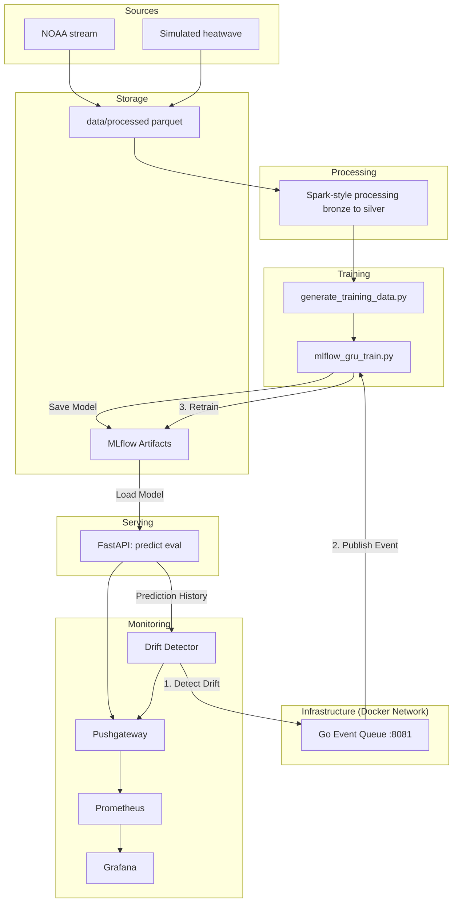
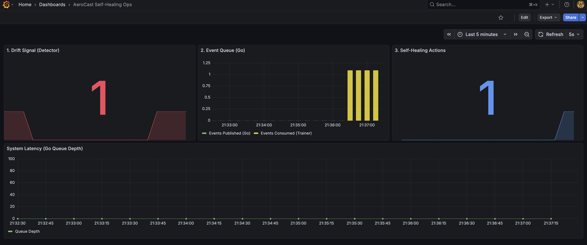
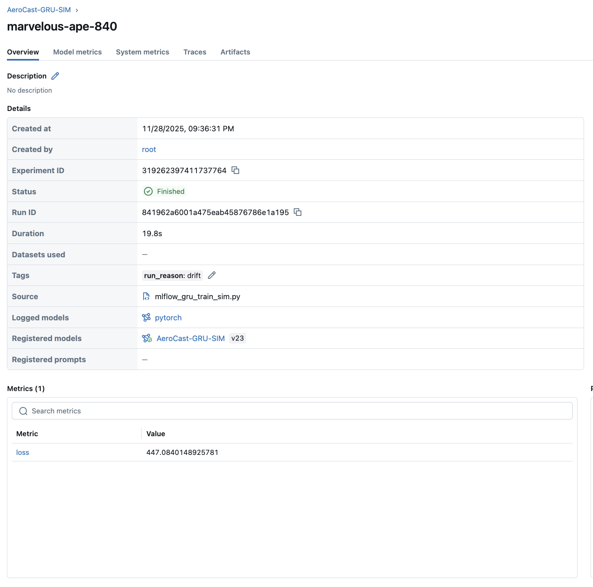
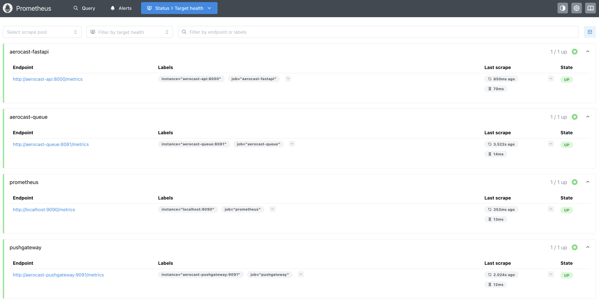
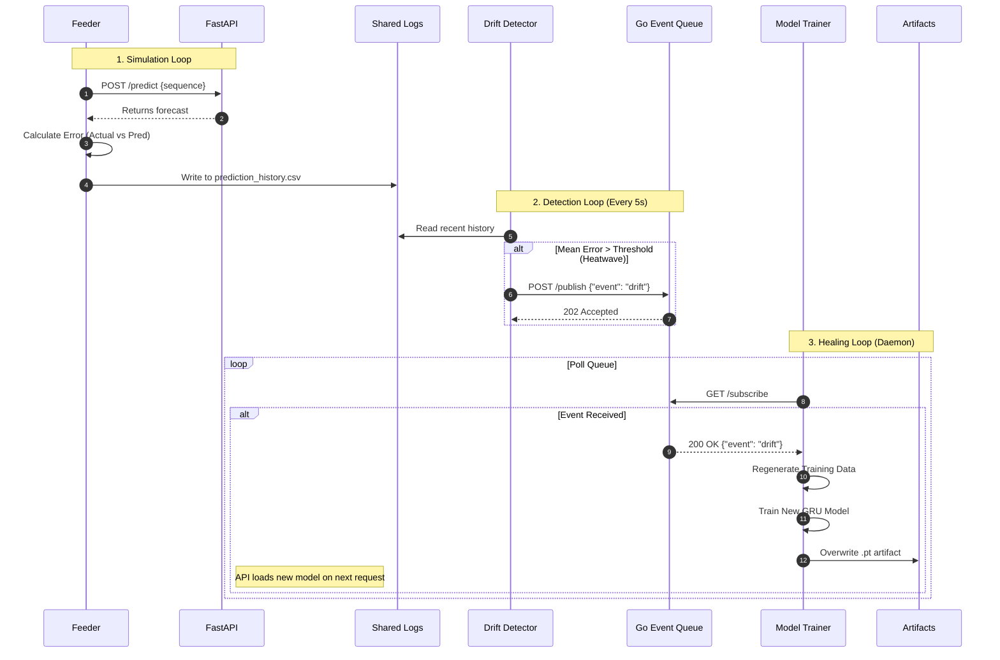

# AeroCast

[](https://github.com/mdgolammafuz/aeroCast/actions/workflows/ci.yml)

AeroCast is a real-time forecasting pipeline: streaming data in, landing it to storage, training a model, monitoring it for drift, and triggering retrains — with Prometheus/Grafana watching the whole loop. It includes the NOAA path (realistic, stable), the simulated path (drift-on-purpose), monitoring, and the self-heal loop.

--
Core capabilities:
- Streaming-style ingestion (realistic and simulated)
- FastAPI serving surface
- Drift detection that triggers retraining events
- Event-driven orchestration via Go microservice (replacing file-based flags)
- Trainers that log to MLflow and refresh artifacts
- Prometheus + Pushgateway + Grafana for observability
- Helm chart for Kubernetes
- Terraform wrapper to apply the chart
---

## Repository layout (curated)

```text
.
├── Dockerfile.api
├── Dockerfile.worker
├── docker-compose.yml
├── serving/                 # FastAPI app
├── streaming/               # ingestion + client feeders
├── data/                    # parquet landing + CSV builders
├── training/                # GRU + Prophet trainers (MLflow)
├── monitoring/              # drift detector → retrain.flag
├── artifacts/               # model files already built
├── prometheus/              # prometheus.yml
├── grafana/                 # provisioning
├── helm/aerocast            # Helm chart
├── infra/main.tf            # Terraform → install chart
├── tests/                   # API + state file tests
├── queue/                   # Go Event Queue Microservice 
└── docs/                    # deeper design notes
```
---

## Verification flow for Reviewers

This is the fastest path to check out that AeroCast is alive.

1. **Build and Start (Local Docker)**

Use the polyglot profile to enable the Go Queue and all workers.

```bash
docker compose build --no-cache
docker compose --profile polyglot up -d
```
2. **Verify API Health**

```bash
curl http://localhost:8000/healthz
```
Expected: {"ok": true, ...}

3. **Check Feeder Logs**

Ensure the feeder is successfully hitting the API.

```bash
docker logs aerocast-feeder
```
Expected: [Feeder] Actual=... | Pred=...

4. **Verify Queue Health**

```bash
curl http://localhost:8081/metrics
```
Expected: Prometheus metrics (aerocast_queue_depth, etc.)

5. **Trainer activity**

```bash
docker logs -f aerocast-trainer
```
Expected: a training run finishing with a reason (drift / schedule).

6. **Kubernetes install**

```bash
helm upgrade --install aerocast ./helm/aerocast -n aerocast --create-namespace
kubectl get pods -n aerocast
```
Expected: API, Prometheus, Grafana pods in `Running` state.

7. **Port-forward checks**

```bash
kubectl port-forward -n aerocast svc/aerocast-api 8000:8000
kubectl port-forward -n aerocast svc/aerocast-grafana 3000:3000
kubectl port-forward -n aerocast svc/aerocast-prometheus 9090:9090
```
Then hit `http://localhost:8000/healthz`, open Grafana, open Prometheus.

8. **Prometheus sees Pushgateway**

Open Prometheus → Targets → `pushgateway` should be UP.

---

## High-level architecture

<!-- mermaid diagram -->


---

## Business Impact (Projected)

### Problem

In many teams, short-term forecasting still looks like this:
- Analysts pull raw data into Excel or a notebook,
- Fit a quick model or eyeball a trend,
- Deploy nothing, and revisit everything when behavior drifts.

That leads to:
- Hours of manual work per forecast,
- Silent model degradation when the underlying process changes,
- No audit trail for “who changed what, when”.

### What AeroCast Automates

AeroCast wires together:

- Streaming ingestion (NOAA or simulated feed),
- A GRU-based forecaster served behind FastAPI,
- Drift detection on recent prediction errors,
- A retrain loop (flag → retrain script → new weights),
- Prometheus + Grafana for live metrics.

So instead of hand-built one-off forecasts, you get a small, always-on forecasting service with guardrails.

### Example Time & Cost Impact (Illustrative)

Take a team that produces a weekly short-term forecast (e.g. demand, load, or capacity):

- Manual workflow:
  - ~2.5 hours per forecast (data prep + modeling + reporting),
  - 52 forecasts/year → ~130 hours/analyst/year.

- With AeroCast-style automation:
  - Forecast generation is automatic,
  - Human time is mostly review and interpretation, say ~0.5 hours/week,
  - ~26 hours/analyst/year.

**Time saved (per analyst):**  
≈100 hours/year.  
At an all-in cost of €60/hour, that’s ≈€6,000/analyst/year.  
For 3 analysts: ≈€18,000/year.

### System Cost (Rough Order of Magnitude)

For a small-team deployment you can stay roughly in this range:

- 1× FastAPI service + 1× Prometheus + 1× Grafana on a small cloud instance,
- Optional small Kafka / message broker, or just HTTP ingestion,
- Object storage for parquet history.

Using EU cloud pricing (Hetzner / small AWS EC2 + S3), a realistic budget for a low-traffic deployment is on the order of **€1,000–€1,500/year**.

That’s not a production cost model, but it shows the **direction**: one small service can realistically pay for itself with a few hours of analyst time saved per month.

---

## Performance & Benchmarks

### Forecast Accuracy – NOAA (Chicago O’Hare, 2024)
Data:

- Source: NOAA Local Climatological Data (LCD v2)
- Station: USW00094846 (Chicago O’Hare)
- Year: 2024
- Train: first ~9 months
- Test: last 3 months
- Features: temperature + time-of-day / day-of-week signals
- Horizon: next-step forecast with a 24-hour window

Models:

- GRU (this repo)
- Naive (last value)
- Prophet (hourly config)

Results (test period):

| Model                     | RMSE (°F) | Notes                                 |
|---------------------------|----------:|----------------------------------------|
| **GRU (AeroCast)**        | **≈0.67** | 24h context, simple GRU, no tuning     |
| Naive (last temperature)  | ≈0.77     | Strong baseline for smooth series      |
| Prophet                   | ≈13.8     | Mis-specified for this setup (hourly)  |

The GRU beats a strong naive baseline on this real-weather slice. Prophet performs poorly here with the current configuration, which is why AeroCast treats Prophet as an *optional* baseline, not the primary model.

The exact JSON output lives in `bench/accuracy_noaa_sample.json`.

*Prophet baseline:* Prophet performs poorly on this hourly 1-step-ahead setup (RMSE ≈ 13.8°F). It is optimized for smooth trend + seasonality rather than short-horizon, persistence-dominated forecasting, so we treat it as a non-competitive reference and focus on GRU vs naive.

### Prediction API performance (local k6 run)

We ran a k6 load test against the `/predict` endpoint on a single Uvicorn worker
(local laptop, 50 VUs, 40s, JSON body with a 24-step sequence).

From `bench/k6_summary.json`:

- **Throughput:** ~206 requests/second (8.2k requests over 40 seconds)
- **p95 latency:** ~20 ms
- **Error rate:** 0% (all responses HTTP 200, single endpoint)

These numbers are from a local dev environment, but they show that the FastAPI +
GRU prediction endpoint stays well under 50 ms p95 even under moderate concurrent
load.

### Simulated drift detection (heatwave demo)

For the synthetic drift demo we use a 1D temperature stream (calm → heatwave)
and a simple rule-based detector:

- Drift is defined as the 6-point rolling mean of temperature crossing **38 °C**.
- The detector scans `logs/prediction_history.csv` every few seconds and logs
  events to `logs/drift.log`.

On a single COOL→HOT episode, `scripts/eval_drift_sim.py` produced
`bench/drift_eval.json`:

- **True Positives:** 1
- **False Positives:** 0
- **False Negatives:** 0
- **Precision / Recall:** 1.0 / 1.0 (for this run)
- **Average detection latency:** ~0.1 minutes (~6 seconds)

This is a small, controlled demo, not a full ROC study – its purpose is to show
that the detector actually fires when the simulated heatwave hits and does not
raise alerts unnecessarily during the calm period.

---

## Two pipelines

### 1. NOAA-like (stable)
- Schema:
  - `ts: timestamp`
  - `temperature: float`
  - `windspeed: float`
  - `pressure: float`
- Stored under: `data/processed/noaa/*.parquet`
- CSV builder: `data/generate_training_data.py`
- Trainer: `training/mlflow_gru_train.py`
- Even though the data is stable, the API still exposes `/routine-retrain-check` so the loop can stay active.

### 2. Simulator (drift-on-purpose)
- Schema:
  - `ts: timestamp`
  - `temperature: float`
- Stored under: `data/processed/part-*.parquet`
- CSV builder: `data/generate_training_data_sim.py`
- Trainer: either overwrite the main CSV and run the normal trainer:
  ```bash
  cp data/training_data_sim.csv data/training_data.csv
  python training/mlflow_gru_train.py
  ```
  or use the dedicated sim trainer:
  ```bash
  python training/mlflow_gru_train_sim.py
  ```
- Feeder: `streaming/client/live_predictor_feeder_sim.py`  
  calls `/predict` and `/eval`, and writes `logs/prediction_history.csv`, which gives the drift detector something to analyze.

---

## The Self-Healing Demo (Full Experiment Runbook)

This sequence reproduces the "Drift → Queue → Retrain" loop. Follow these steps exactly to verify the system's autonomous recovery capabilities.

### Phase 1: Clean Slate & Bootstrap

Generate baseline data and train the initial model locally so the system starts in a healthy state.

**1. Stop and Clean**

```bash
docker compose down
docker rm -f $(docker ps -aq) 2>/dev/null

# Remove state files and old data
rm -f logs/prediction_history.csv logs/drift.log logs/drift_count.txt logs/last_drift_state.txt logs/last_drift.txt
rm -f data/processed/part-*.parquet
rm -f data/training_data_sim.csv
```

**2. Generate Calm Data**  
Run the simulator in calm mode for 60 seconds to create a baseline.

```bash
CALM_ONLY=1 python streaming/ingestion/heatwave_simulator.py
# Wait until ~12-15 files are generated, then Press Ctrl+C
```

**3. Train Initial Model**  
Prepare the CSV and train the model so the API has an artifact to load on startup.

```bash
python data/generate_training_data_sim.py
python training/mlflow_gru_train_sim.py --setup
```

### Phase 2: Launch System

Start the full stack. The `feeder` service will automatically start predicting using the initial model.

```bash
docker compose --profile polyglot up -d
```

### Phase 3: Trigger Drift (The Heatwave)

Inject a "Heatwave" anomaly to force the system to react.

```bash
python streaming/ingestion/heatwave_simulator.py
# Let this run. Temperature values will spike >35.0.
```

### Phase 4: Observe Self-Healing

Watch the logs to see the architecture in action.

**1. Drift Detected**

```bash
docker logs -f aerocast-drift
```

Output:  
`[drift] DRIFT DETECTED! Event posted to queue`

**2. Retraining Triggered**

```bash
docker logs -f aerocast-trainer
```

Output:  
`[train-sim] Received event from queue: drift` → `Regenerating CSV` → `Training complete`

**3. Queue Metrics Verification**

```bash
curl -s http://localhost:8081/metrics | grep aerocast_queue_published_total
```

Output should be: `> 0`

-----

## Known Limitations (V1)

**1. Model Scaling**  
The current GRU model is trained on raw, unscaled temperature data. As a result, predictions may be dampened (values < 1.0) or slow to converge during the short training demo.

- **Impact:** The *magnitude* of the forecast is inaccurate, but the *direction* and error patterns (drift) are preserved.  
- **Mitigation:** The drift detector triggers based on the **actual** value stream (which correctly spikes during the heatwave), so the self-healing loop functions correctly despite the model's scaling issue.  
- **Roadmap:** Implement a Scikit-Learn `StandardScaler` pipeline to normalize inputs/outputs.

**2. NOAA Pipeline Status**  
The "Self-Healing" architecture (Go Queue + Daemons) is fully implemented for the **Simulation** pipeline to facilitate rapid demonstration.

- **NOAA Pipeline:** Currently runs as a legacy file-based script.  
- **Roadmap:** Port the NOAA `live_predictor_feeder.py` and `mlflow_gru_train.py` to use the new buffer logic and queue polling system established in the Simulation.

---

## 4. Observability & Monitoring

AeroCast includes a full observability stack to visualize the system's health and the self-healing loop in real-time.

### MLOps Dashboard (Grafana)
Visualizing the **Drift -> Queue -> Retrain** cycle.

- **Panel 1 (Drift Signal):** The red spike indicates the Drift Detector found an anomaly (Simulated Heatwave).
- **Panel 2 (Event Queue):** The yellow bars show the Drift event being published to the Go Queue.
- **Panel 3 (Self-Healing):** The counter increments when the Trainer successfully consumes the event and retrains the model.

### System Health (Prometheus)
All microservices (Python API, Go Queue, Pushgateway) are automatically discovered and scraped via Docker service discovery.

- **`aerocast-queue`:** The new Go microservice is active and exporting custom metrics (queue depth, event counts).

### Model Registry (MLflow)
Every retraining event is logged with parameters, metrics (RMSE), and artifacts.


**How to view MLflow locally:**

The `mlruns` directory is mounted to the host. You can inspect the full training history without entering Docker:
```bash

# Install mlflow locally if needed: pip install mlflow
mlflow ui --backend-store-uri ./mlruns --port 5000
```
---

## Self-healing loop

<!-- mermaid diagram -->



---

## Serving (FastAPI)

Entrypoint:

```bash
uvicorn serving.fastapi_app:app --host 0.0.0.0 --port 8000
```

Endpoints:
- `GET /healthz`
- `POST /predict`
- `POST /eval`
- `GET /metrics`
- `POST /routine-retrain-check`

Tested in CI with `pytest` and `httpx` (Starlette TestClient requires `httpx`).

---

## Streaming / Kafka / Spark

- `streaming/ingestion/` and `streaming/processing/` mimic a Kafka/Spark ingestion path landing parquet under `data/processed/`.
- Folder structure under `data/` shows bronze/silver style layers, which is common in Spark or Delta pipelines.
- The docs folder contains extra notes:
  - `docs/kafka_startup.md`
  - `docs/RealTime_Predictor_Loop.md`
  - `docs/readme_monitoring.md`

---

## Data prep (schemas)

### 1. NOAA → CSV
Source: `data/processed/noaa/*.parquet`  
Expected columns: `ts, temperature, windspeed, pressure`  
Windowed (e.g. 5 steps):

```text
t0_temp, t0_wind, t0_pressure,
t1_temp, t1_wind, t1_pressure,
t2_temp, t2_wind, t2_pressure,
t3_temp, t3_wind, t3_pressure,
t4_temp, t4_wind, t4_pressure,
target
```

This is exactly what `training/mlflow_gru_train.py` consumes.

### 2. Simulator → CSV
Source: `data/processed/part-*.parquet`  
Expected columns: `ts, temperature`  
Windowed (5 steps):

```text
t0_temp, t1_temp, t2_temp, t3_temp, t4_temp, target
```

This is what `data/generate_training_data_sim.py` writes.  
After that, either copy to the main CSV or call the sim trainer.

---

## Deployment options

### 1. Local (compose)

- start everything:

  ```bash
  docker compose build
  docker compose --profile polyglot up -d
  ```
- verify:

  ```bash
  curl http://localhost:8000/healthz   
  curl http://localhost:8081/metrics
  ```

### 2. Kubernetes (Helm)

For a complete, step-by-step guide on setting up the cluster, loading images, and running the self-healing experiment inside Kubernetes, please see the detailed runbook:

**[docs/k8s_helm_terraform_runbook.md](docs/k8s_helm_terraform_runbook.md)**

- chart is in `helm/aerocast`
- install / upgrade:

  ```bash
  helm upgrade --install aerocast ./helm/aerocast     --namespace aerocast --create-namespace
  kubectl get pods -n aerocast
  ```
- port-forward to test API, Grafana, Prometheus.

### 3. Terraform (IaC wrapper)
- file: `infra/main.tf`
- providers: `kubernetes` and `helm`
- applies the local chart from `../helm/aerocast` into the `aerocast` namespace
- in practice:

  ```bash
  cd infra
  terraform init
  terraform apply
  ```
**Successful Provisioning:**


- if the release already exists, Terraform will recognize it and update in place; timeouts were increased, and `wait = false` was used to avoid long blocking applies on local clusters.

---

## CI

Single workflow to keep things predictable: `.github/workflows/ci.yml`

- triggers on `main` and `helm`,
- installs Python 3.10,
- installs runtime + dev requirements,
- creates `serving/__init__.py` on CI to make imports resolvable,
- runs `pytest -q` (three tests in `tests/`),
- logs into GHCR with `${{ secrets.GITHUB_TOKEN }}`,
- builds:
  - `ghcr.io/mdgolammafuz/aerocast-api:latest`
  - `ghcr.io/mdgolammafuz/aerocast-worker:latest`

Extra docker-only workflows were removed to avoid parallel duplicate runs.

---

## Security / production notes

- no secrets committed,
- `retrain.flag` is a local-file contract; a production system would move this to a message bus or DB,
- Pushgateway and Prometheus are cluster-internal in the Helm chart; ingress/auth is left out for brevity,
- MLflow in `mlruns/` is local; a remote tracking server and artifact store would be used in production,
- GHCR is used for images; in a company, an internal registry and OIDC login would be preferred.

---

## GDPR / Data Protection Notes

> For EU / German deployments, see also **Section 16** on data residency and auditability.  
> This section focuses specifically on what happens the moment personal data enters the pipeline.

This repository is built and tested against synthetic and public-weather–style data. In its current form it does not intend to process personal data. That said, the moment this pipeline is pointed at real operational streams that contain identifiers or anything user-related, the following applies.

1. Data categories
    - Current demo: time series (timestamps, temperature, windspeed, pressure), model artifacts, and operational metrics. No names, emails, IPs, device IDs, or location traces.

    - If you add user or device context to the stream, that becomes personal data under GDPR and the rest of this section becomes mandatory.

2. Purpose limitation

    - The pipeline is designed for forecasting + model maintenance (drift → retrain).

    - Do not reuse collected data for unrelated analytics without documenting a new purpose.

3. Data minimization

    - Keep only the columns required to build the time window (ts + numerical features).

    - Drop free-text or high-cardinality IDs unless they are needed for reconciliation.

    - If personal or quasi-personal fields arrive on the topic/stream, strip them in the ingestion step before writing to data/processed/....

4. Storage and retention

    - Parquet under data/processed/... and CSVs under data/ are kept for convenience. In a real environment, define retention (e.g. 30–90 days for raw, longer for aggregates).

    - Generated artifacts in artifacts/ (GRU, Prophet) may encode training data characteristics. Treat them as data-bearing and subject to rotation.

5. Logging and monitoring

    - The current setup logs to logs/ and exposes Prometheus metrics. These should not contain personal data.

    - If you add per-user evaluation or per-device metrics, either aggregate them before exporting or scrub identifiers.

6. Data subject rights

    - If personal data ever lands in storage, you must be able to:

      - locate it (which table/file/bucket),

      - delete it on request, and

      - retrain or mark old models as using pre-deletion data.

    - Because this project uses simple file-based retrain triggers (retrain.flag), the cleanest approach is “delete → regenerate training CSV → retrain → replace artifact”.

7. Transfers and hosting

    - This demo assumes local/docker/k8s. In production, document where Prometheus, Grafana, and MLflow are hosted, and whether data leaves the EEA.

    - If you push images to GHCR, that’s code and config, not personal data — don’t bake secrets or PII into images.

8. Security basics

    - Add auth in front of FastAPI, Prometheus, and Grafana in any non-local setup.

    - Don’t commit real API keys, secrets, or customer data samples.

9. Accountability

    - If this is adopted in a real org with real data, run a short DPIA/records-of-processing note: “time-series ingestion for forecasting; retention X; access Y; legal basis Z”.

---

## EU / German Deployment Notes

This repo runs locally by default and uses either synthetic time series or public NOAA-style weather data. There is no personal data in the demo setup.

For a real deployment in a German / EU context, the main points are:

- **Data residency**
  - Run the stack in an EU region (e.g. Hetzner, AWS `eu-central-1`, GCP `europe-west3`).
  - Keep parquet history, Prometheus TSDB, and model artifacts in the same region.
  - Avoid exporting raw logs or time series outside the EEA.

- **Auditability**
  - Parquet under `data/processed/...` plus `logs/` already form an audit trail of:
    - raw inputs,
    - model predictions,
    - drift detections and retrains.
  - With longer retention and access controls, this is a good starting point for
    “Nachvollziehbarkeit” as expected by HGB / GoBD style record-keeping.

- **Privacy / personal data**
  - The demo assumes pure time-series (temperature, etc.).  
  - If you add user or device identifiers, everything in **“15. GDPR / Data Protection Notes”** becomes mandatory:
    retention, deletion, access logs, and model retraining after erasure.

- **Positioning**
  - AeroCast is a **technical reference implementation** for streaming forecasts with drift detection.
  - It is **not** sold as a ready-made BaFin- or GoBD-certified product; any real rollout needs an org-specific legal and DPIA review.

---

## License

This project is licensed under the **MIT License**.

```text
MIT License

Copyright (c) 2025

Permission is hereby granted, free of charge, to any person obtaining a copy
of this software and associated documentation files (the "Software"), to deal
in the Software without restriction, including without limitation the rights
to use, copy, modify, merge, publish, distribute, sublicense, and/or sell
copies of the Software, and to permit persons to whom the Software is
furnished to do so, subject to the following conditions:

The above copyright notice and this permission notice shall be included in all
copies or substantial portions of the Software.

THE SOFTWARE IS PROVIDED "AS IS", WITHOUT WARRANTY OF ANY KIND, EXPRESS OR
IMPLIED, INCLUDING BUT NOT LIMITED TO THE WARRANTIES OF MERCHANTABILITY,
FITNESS FOR A PARTICULAR PURPOSE AND NONINFRINGEMENT. IN NO EVENT SHALL THE
AUTHORS OR COPYRIGHT HOLDERS BE LIABLE FOR ANY CLAIM, DAMAGES OR OTHER
LIABILITY, WHETHER IN AN ACTION OF CONTRACT, TORT OR OTHERWISE, ARISING FROM,
OUT OF OR IN CONNECTION WITH THE SOFTWARE OR THE USE OR OTHER DEALINGS IN THE
SOFTWARE.
```
