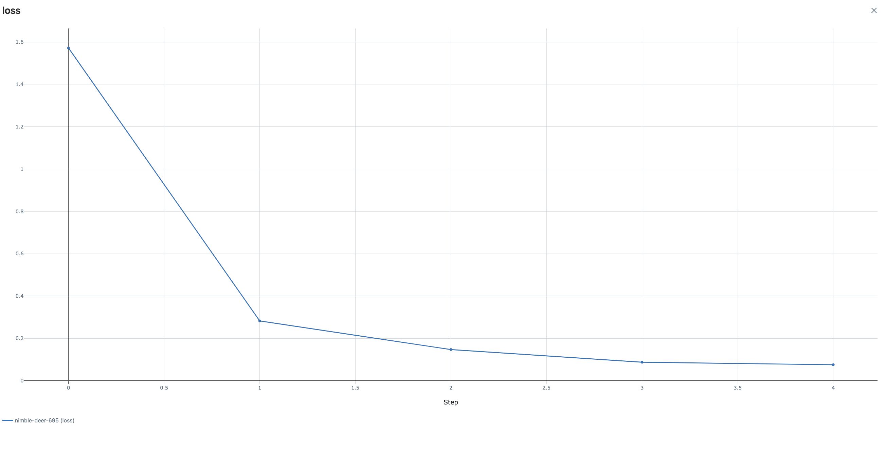
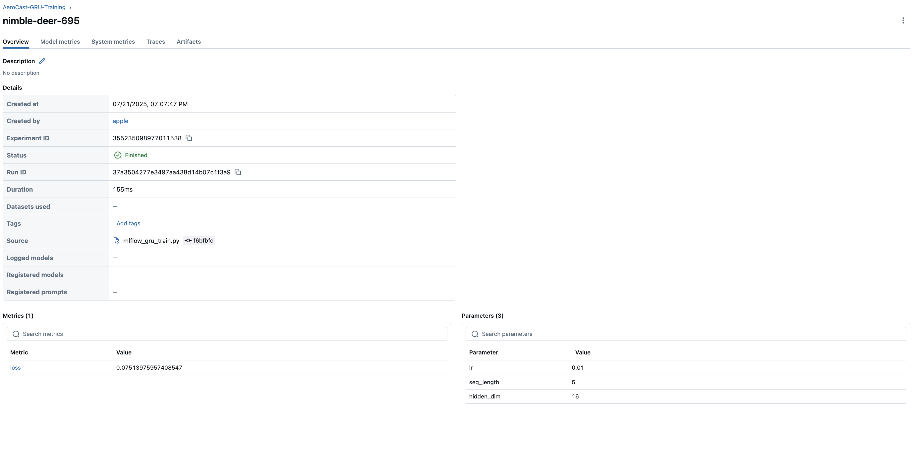

# 🌤️ AeroCast++: Real-Time Weather Forecasting Pipeline

AeroCast++ is a production-grade, agentic forecasting system built with streaming ingestion (Kafka), PySpark-based batch processing, GRU sequence modeling, MLflow tracking, and DVC versioning — all orchestrated for real-time sensor data forecasting.

---

## 🧠 What Does AeroCast++ Do?

It forecasts weather sensor values in real time by:
- Ingesting sensor streams via Kafka
- Processing and storing structured data
- Training a GRU model for time series forecasting
- Tracking experiments using MLflow
- Versioning model artifacts using DVC
- Serving forecasts via FastAPI (WIP)

---

## 🔧 Core Technologies

| Component     | Tech Stack                              |
|--------------|------------------------------------------|
| Ingestion     | Kafka, Simulated Sensor Streams         |
| Processing    | PySpark, Parquet Pipelines              |
| Modeling      | PyTorch GRU                             |
| Monitoring    | Anomaly Detection + Grafana             |
| Logging       | MLflow                                  |
| Versioning    | DVC                                     |
| Serving       | FastAPI (Coming Soon)                   |
| Cloud         | Azure Event Hub (Optional Integration)  |

---

## 📁 Folder Structure

```bash
.
├── README.md
├── api
├── artifacts
│   └── gru_weather_forecaster.pt
├── cloud
│   └── azure_eventhub_config.py
├── data
│   ├── checkpoints
│   ├── parquet_loader.py
│   ├── processed
│   ├── raw
│   └── simulator.py
├── datasets
│   ├── processed
│   └── raw
├── docker
│   └── kafka
├── docs
│   ├── Data_Sequence_Logic.md
│   ├── GRU_Module_Architecture.md
│   ├── Live_Prediction_Test.md
│   ├── README_GRU.md
│   ├── RealTime_Predictor_Loop.md
│   ├── kafka_startup.md
│   ├── live_prediction_with_anomaly.md
│   ├── mlflow_integration_explained.md
│   ├── mlflow_loss_curve.png
│   ├── mlflow_run_summary.png
│   └── dvc_integration_explained.md
├── ingestion
├── logs
├── model
│   └── __init__.py
├── monitoring
│   ├── __init__.py
│   ├── anomaly_detector.py
│   └── mlflow_tracking
├── notebooks
├── processing
├── requirements.txt
├── scripts
│   └── kafka_startup.md
├── serving
│   └── fastapi_app.py
├── simulator
├── streaming
│   ├── ingestion
│   └── processing
├── tests
│   ├── gru_hook_debug.py
│   ├── live_predictor.py
│   └── parquet_preview.py
├── training
│   ├── mlflow_gru_train.py
│   └── train_gru.py
└── venv/ and mlruns/ excluded via .gitignore
```

---

## 📊 MLflow Integration

We integrated MLflow to track GRU training runs, log parameters, loss metrics, and visualize training progress.

📄 [See MLflow Execution Details →](docs/mlflow_integration_explained.md)

---

## 🧬 DVC Versioning

Model artifacts (like trained GRU weights) are version-controlled with DVC, ensuring reproducibility and modularity.

📄 [See DVC Setup Details →](docs/dvc_integration_explained.md)

---

## 🖼️ Screenshots

<p align="center">
  
</p>

<p align="center">
  
</p>

---

## 🚀 Next Steps

- ✅ GRU + MLflow + DVC (DONE!)
- 🔄 Integrate FastAPI for serving
- 📈 Real-time inference + drift detection
- 📊 Grafana dashboard


