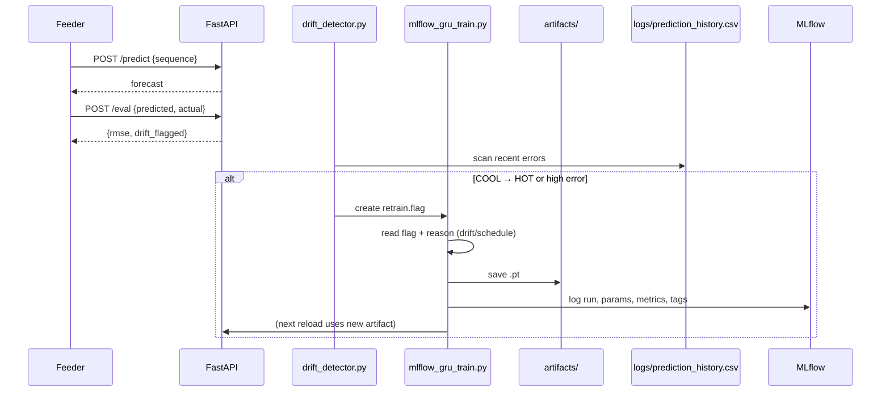
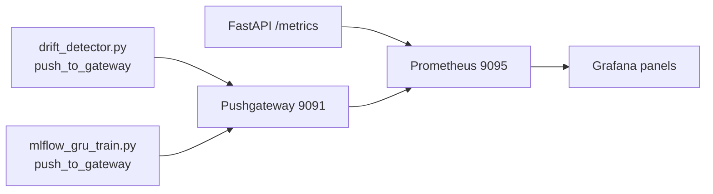

# AeroCast
_self-healing, streaming, forecasty goodness_

AeroCast++ is a small-but-serious demo of how to build a real-time forecasting pipeline: streaming in, landing to storage, training a model, watching it drift, and kicking off retrains — with Prometheus/Grafana watching.
It includes the NOAA path (realistic, stable), the simulated path (drift-on-purpose), monitoring, and the self-heal loop.
---

## 1. High-Level Architecture

```mermaid
flowchart LR
    subgraph Sources
        A1[NOAA 3-feature stream]\ntemp/wind/pressure
        A2[Simulated heatwave]\n1D temp
    end

    subgraph Ingestion/Storage
        B1[Parquet: data/processed/noaa]
        B2[Parquet: data/processed/ (sim)]
    end

    subgraph Processing
        C1[Spark streaming bronze]
        C2[Spark 5-min silver]
    end

    subgraph Training
        D1[generate_training_data.py\n(3D → CSV)]
        D2[generate_training_data_sim.py\n(1D → CSV)]
        D3[mlflow_gru_train.py]
        D4[mlflow_gru_train_sim.py]
        D5[train_prophet.py]
    end

    subgraph Serving
        E1[FastAPI /predict, /eval, /routine-retrain-check]
    end

    subgraph Monitoring
        F1[Prometheus]
        F2[Pushgateway]
        F3[Grafana]
        F4[monitoring/drift_detector.py]
    end

    A1 --> B1
    A2 --> B2
    B1 --> C1 --> C2
    B1 --> D1
    B2 --> D2
    D3 -->|.pt| E1
    D4 -->|.pt (sim)| E1
    D5 -->|prophet_model.json| E1
    E1 -->|/eval errors| F4 -->|retrain.flag| D3
    E1 -->|/metrics| F1
    F4 --> F2 --> F1 --> F3
```

This shows the two data shapes (NOAA 3D, sim 1D) funneling into the same serving surface.

---

## 2. Two Pipelines

### 2.1 NOAA (realistic, stable)
- Input schema:  
  - `ts: timestamp`  
  - `temperature: float`  
  - `windspeed: float`  
  - `pressure: float`  
  - optional: `v`, `station` (we drop them)
- Stored under: `data/processed/noaa/*.parquet`
- CSV builder: `data/generate_training_data.py`
- Trainer: `training/mlflow_gru_train.py`
- Feeder: `streaming/client/live_predictor_feeder.py`
- Drift: mostly **won't** happen → we add **routine retrain** (`/routine-retrain-check`) so the self-healing still exists.

### 2.2 Simulator (drift-on-purpose)
- Input schema:
  - `ts: timestamp`
  - `temperature: float` (starts 20–30°C, then ramps)
- Written to: `data/processed/part-*.parquet`
- CSV builder: `data/generate_training_data_sim.py`
- Trainer (option A): copy sim CSV over the main one and run main trainer  
  ```bash
  cp data/training_data_sim.csv data/training_data.csv
  python training/mlflow_gru_train.py
  ```
- Trainer (option B): use the dedicated sim trainer  
  ```bash
  python training/mlflow_gru_train_sim.py
  ```
- Feeder: `streaming/client/live_predictor_feeder_sim.py`  
  - reads 1D temp  
  - **fabricates** windspeed and pressure so FastAPI (which expects 3D) does not break  
  - calls `/predict` and then `/eval` to log online error  
  - appends to `logs/prediction_history.csv` (the drift detector reads this)

---

## 3. Self-Healing Loop (the story you tell)



- Drift detector **only** increments when we go from *cool → hot* (to avoid counter spam).
- Retrain reason is written in the flag: `drift ...` or `schedule ...`
- Trainer removes `retrain.flag` after consumption.
---

## 4. Data prep (schemas)

### 4.1 NOAA → CSV
- Source: `data/processed/noaa/*.parquet`
- Expected columns: `ts, temperature, windspeed, pressure`
- Windowed features (WINDOW=5) → columns become:

```text
t0_temp, t0_wind, t0_pressure,
t1_temp, t1_wind, t1_pressure,
...
t4_temp, t4_wind, t4_pressure,
target
```

This is what `training/mlflow_gru_train.py` expects.

### 4.2 Simulator → CSV
- Source: `data/processed/part-*.parquet`
- Expected columns: `ts, temperature`
- Windowed features (WINDOW=5) → columns:

```text
t0_temp, t1_temp, t2_temp, t3_temp, t4_temp, target
```

This is what `data/generate_training_data_sim.py` writes.  
We then either:
- overwrite `data/training_data.csv` with it, or
- use the dedicated sim trainer.

---

## 5. Runbook (copy/paste demo)

### 5.1 Start API

```bash
uvicorn serving.fastapi_app:app --reload
```

### 5.2 Start Prometheus (your port was busy)

```bash
prometheus \
  --config.file=prometheus/prometheus.yml \
  --web.listen-address="0.0.0.0:9095" \
  --storage.tsdb.path="/tmp/prom-aerocast"
```

Then in Grafana → Add data source → Prometheus → URL = `http://localhost:9095`.

---

### 5.3 Simulator drift demo

```bash
# 0) clean
rm -f retrain.flag last_retrain.txt
rm -f data/processed/part-*.parquet
rm -f logs/prediction_history.csv logs/last_drift_state.txt logs/last_drift.txt logs/drift_count.txt

# 1) collect calm data for both Prophet & GRU
CALM_ONLY=1 python streaming/ingestion/heatwave_simulator.py
# ... let it run 60–90s, then Ctrl+C

# 2) build CSV from calm
python data/generate_training_data_sim.py

# 3) train Prophet baseline
python training/train_prophet.py

# 4) train GRU on same calm window
cp data/training_data_sim.csv data/training_data.csv
python training/mlflow_gru_train.py

# 5) start simulated feeder (this hits /predict and /eval and writes logs/prediction_history.csv)
python streaming/client/live_predictor_feeder_sim.py

# 6) now start HEATWAVE version (no CALM_ONLY)
python streaming/ingestion/heatwave_simulator.py

# 7) run drift detector to turn heat into retrain.flag
python monitoring/drift_detector.py

# 8) consume the flag → retrain
python training/mlflow_gru_train.py
```

That is the entire self-heal story.
---

## 6. Monitoring stack



Metrics we already have:
- `predictions_total{model_type="GRU"}`
- `aerocast_last_rmse`
- `aerocast_predict_latency_ms`
- `aerocast_drift_flag`
- `aerocast_drift_count`
- `aerocast_retrain_total`
- `aerocast_last_retrain_ts`

Screenshot 2–3 panels for the README.

---

## 7. Security / Prod notes

- local-only demo → no secrets in code
- `retrain.flag` is a **file-based contract** to keep processes decoupled without a message bus
- simulator + NOAA share the **same API shape** → migration-safe
- Prometheus/grafana exposed on localhost
- For real prod: replace flag with topic/DB, secure Pushgateway, and run MLflow with a remote backend store.

---

## 8. Deployment

1. **Docker Compose**: `fastapi`, `prometheus`, `grafana`, `pushgateway` → all local
2. **Later**: add Spark/Kafka containers
3. **Even later**: Helm chart to deploy the same services to k8s
4. **Terraform**: only to provision infra (cluster, storage)
---

## 9. Why GRU was “flat” in testing?

During testing we saw GRU output stuck around 4–6 or ~13. That happens when:
- you trained on too few calm rows,
- you copied a 1D CSV into the 3D trainer without changing `N_FEATS`,
- or the artifacts folder still had the old `.pt`.

In the current layout:
- simulator → `data/training_data_sim.csv`
- copy to main CSV → `data/training_data.csv`
- **then** run `training/mlflow_gru_train.py` so FastAPI loads the right `.pt`.
---
