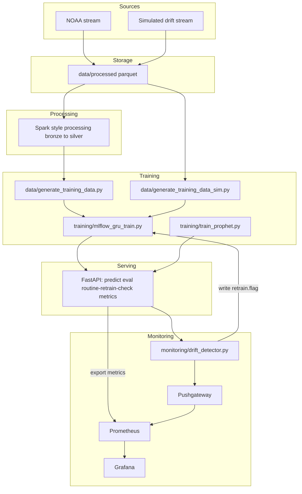

# AeroCast
AeroCast is a small-but-serious real-time forecasting pipeline: streaming in, landing to storage, training a model, watching it drift, and kicking off retrains — with Prometheus/Grafana watching. It includes the NOAA path (realistic, stable), the simulated path (drift-on-purpose), monitoring, and the self-heal loop.

--
- streaming-style ingestion (realistic and simulated),
- FastAPI serving surface,
- drift detection that raises a `retrain.flag`,
- trainers that log to MLflow and refresh artifacts,
- Prometheus + Pushgateway + Grafana,
- Helm chart for Kubernetes,
- Terraform wrapper to apply the chart,
- CI that tests and publishes GHCR images.

---

## 1. Repository layout (curated)

```text
.
├── Dockerfile.api
├── Dockerfile.worker
├── docker-compose.yml
├── serving/                 # FastAPI app
├── streaming/               # ingestion + client feeders
├── data/                    # parquet landing + CSV builders
├── training/                # GRU + Prophet trainers (MLflow)
├── monitoring/              # drift detector → retrain.flag
├── artifacts/               # model files already built
├── prometheus/              # prometheus.yml
├── grafana/                 # provisioning
├── helm/aerocast            # Helm chart
├── infra/main.tf            # Terraform → install chart
├── tests/                   # API + state file tests
└── docs/                    # deeper design notes
```

This is the surface that matters. Local state (`logs/`, `mlruns/`, `.terraform/`, `venv/`) is intentionally not front-and-center.

---

## 2. Verification flow for reviewers

This is the fastest path to check out that AeroCast is alive.

1. **Docker local run**
   ```bash
   docker compose up
   curl http://localhost:8000/healthz
   ```
   Expected: JSON like `{ "ok": true, ... }`.

2. **Metrics alive**
   ```bash
   curl http://localhost:8000/metrics
   ```
   Expected: `aerocast_*` Prometheus metrics.

3. **Trainer activity**
   ```bash
   docker logs -f aerocast-trainer
   ```
   Expected: a training run finishing with a reason (drift / schedule).

4. **Kubernetes install**
   ```bash
   helm upgrade --install aerocast ./helm/aerocast -n aerocast --create-namespace
   kubectl get pods -n aerocast
   ```
   Expected: API, Prometheus, Grafana pods in `Running` state.

5. **Port-forward checks**
   ```bash
   kubectl port-forward -n aerocast svc/aerocast-api 8000:8000
   kubectl port-forward -n aerocast svc/aerocast-grafana 3000:3000
   kubectl port-forward -n aerocast svc/aerocast-prometheus 9090:9090
   ```
   Then hit `http://localhost:8000/healthz`, open Grafana, open Prometheus.

6. **Prometheus sees Pushgateway**
   - Open Prometheus → Targets → `pushgateway` should be UP.

This is the minimal, observable checklist.

---

## 3. High-level architecture

Two data shapes, one serving plane, with monitoring and retrain in the loop.

---
## Performance & Benchmarks

### Forecast Accuracy – NOAA (Chicago O’Hare, 2024)

1-step ahead hourly temperature, window = 24h  
Train: Jan–Sep 2024, Test: Oct–Dec 2024 (station USW00094846, LCD dataset).

| Model                    | RMSE (°F) |
|--------------------------|----------:|
| **GRU (AeroCast)**       | **0.67**  |
| Naive (last value)       | 0.77      |
| Prophet (hourly, default)| 13.76     |


*Prophet baseline:* Prophet performs poorly on this hourly 1-step-ahead setup (RMSE ≈ 13.8°F). It is optimized for smooth trend + seasonality rather than short-horizon, persistence-dominated forecasting, so we treat it as a non-competitive reference and focus on GRU vs naive.

---

## 4. Two pipelines

### 4.1 NOAA-like (stable)
- Schema:
  - `ts: timestamp`
  - `temperature: float`
  - `windspeed: float`
  - `pressure: float`
- Stored under: `data/processed/noaa/*.parquet`
- CSV builder: `data/generate_training_data.py`
- Trainer: `training/mlflow_gru_train.py`
- Even though the data is stable, the API still exposes `/routine-retrain-check` so the loop can stay active.

### 4.2 Simulator (drift-on-purpose)
- Schema:
  - `ts: timestamp`
  - `temperature: float`
- Stored under: `data/processed/part-*.parquet`
- CSV builder: `data/generate_training_data_sim.py`
- Trainer: either overwrite the main CSV and run the normal trainer:
  ```bash
  cp data/training_data_sim.csv data/training_data.csv
  python training/mlflow_gru_train.py
  ```
  or use the dedicated sim trainer:
  ```bash
  python training/mlflow_gru_train_sim.py
  ```
- Feeder: `streaming/client/live_predictor_feeder_sim.py`  
  calls `/predict` and `/eval`, and writes `logs/prediction_history.csv`, which gives the drift detector something to analyze.

---

## 5. Runbook (demo)

This is the end-to-end demo path.

```bash
# 0) clean
rm -f retrain.flag last_retrain.txt
rm -f data/processed/part-*.parquet
rm -f logs/prediction_history.csv logs/last_drift_state.txt logs/last_drift.txt logs/drift_count.txt

# 1) collect calm data for both Prophet & GRU
CALM_ONLY=1 python streaming/ingestion/heatwave_simulator.py
# ... let it run 60–90s, then Ctrl+C

# 2) build CSV from calm
python data/generate_training_data_sim.py

# 3) train Prophet baseline
python training/train_prophet.py

# 4) train GRU on same calm window
cp data/training_data_sim.csv data/training_data.csv
python training/mlflow_gru_train.py

# 5) start simulated feeder (this hits /predict and /eval and writes logs/prediction_history.csv)
python streaming/client/live_predictor_feeder_sim.py

# 6) now start HEATWAVE version (no CALM_ONLY)
python streaming/ingestion/heatwave_simulator.py

# 7) run drift detector to turn heat into retrain.flag
python monitoring/drift_detector.py

# 8) consume the flag → retrain
python training/mlflow_gru_train.py
```

This path shows the “state-aware” nature: ingestion → model use → error observed → drift detected → flag created → trainer consumes flag → artifacts updated.

---

## 6. Self-healing loop


- the detector increments only on change to keep noise low,
- the trainer clears the flag to keep the channel single-shot,
- metrics are pushed so Prometheus/Grafana can show when retrain happened.

---

## 7. Serving (FastAPI)

Entrypoint:

```bash
uvicorn serving.fastapi_app:app --host 0.0.0.0 --port 8000
```

Endpoints:
- `GET /healthz`
- `POST /predict`
- `POST /eval`
- `GET /metrics`
- `POST /routine-retrain-check`

Tested in CI with `pytest` and `httpx` (Starlette TestClient requires `httpx`).

---

## 8. Streaming / Kafka / Spark

- `streaming/ingestion/` and `streaming/processing/` mimic a Kafka/Spark ingestion path landing parquet under `data/processed/`.
- Folder structure under `data/` shows bronze/silver style layers, which is common in Spark or Delta pipelines.
- The docs folder contains extra notes:
  - `docs/kafka_startup.md`
  - `docs/RealTime_Predictor_Loop.md`
  - `docs/readme_monitoring.md`

---

## 9. Data prep (schemas)

### 9.1 NOAA → CSV
Source: `data/processed/noaa/*.parquet`  
Expected columns: `ts, temperature, windspeed, pressure`  
Windowed (e.g. 5 steps):

```text
t0_temp, t0_wind, t0_pressure,
t1_temp, t1_wind, t1_pressure,
t2_temp, t2_wind, t2_pressure,
t3_temp, t3_wind, t3_pressure,
t4_temp, t4_wind, t4_pressure,
target
```

This is exactly what `training/mlflow_gru_train.py` consumes.

### 9.2 Simulator → CSV
Source: `data/processed/part-*.parquet`  
Expected columns: `ts, temperature`  
Windowed (5 steps):

```text
t0_temp, t1_temp, t2_temp, t3_temp, t4_temp, target
```

This is what `data/generate_training_data_sim.py` writes.  
After that, either copy to the main CSV or call the sim trainer.

---

## 10. Deployment options

### 10.1 Local (compose)
- start everything:
  ```bash
  docker compose up
  ```
- verify:
  ```bash
  curl http://localhost:8000/healthz
  curl http://localhost:8000/metrics
  ```

### 10.2 Kubernetes (Helm)
- chart is in `helm/aerocast`
- install / upgrade:
  ```bash
  helm upgrade --install aerocast ./helm/aerocast     --namespace aerocast --create-namespace
  kubectl get pods -n aerocast
  ```
- port-forward to test API, Grafana, Prometheus.

### 10.3 Terraform (IaC wrapper)
- file: `infra/main.tf`
- providers: `kubernetes` and `helm`
- applies the local chart from `../helm/aerocast` into the `aerocast` namespace
- in practice:
  ```bash
  cd infra
  terraform init
  terraform apply
  ```
- if the release already exists, Terraform will recognize it and update in place; timeouts were increased, and `wait = false` was used to avoid long blocking applies on local clusters.

---

## 11. CI

Single workflow to keep things predictable: `.github/workflows/ci.yml`

- triggers on `main` and `helm`,
- installs Python 3.10,
- installs runtime + dev requirements,
- creates `serving/__init__.py` on CI to make imports resolvable,
- runs `pytest -q` (three tests in `tests/`),
- logs into GHCR with `${{ secrets.GITHUB_TOKEN }}`,
- builds:
  - `ghcr.io/mdgolammafuz/aerocast-api:latest`
  - `ghcr.io/mdgolammafuz/aerocast-worker:latest`

Extra docker-only workflows were removed to avoid parallel duplicate runs.

---

## 12. “Flat” GRU output note

A flat forecast band was observed during development. Probable causes:

1. training performed on a very short calm window → model learned a constant;
2. 1D simulated CSV was passed to the 3D trainer without aligning feature count;
3. old artifact files were still present and kept being loaded.

Current layout makes the flow explicit:

- simulator builds `data/training_data_sim.csv`,
- that file can be copied over `data/training_data.csv`,
- `training/mlflow_gru_train.py` can then be run,
- FastAPI will serve the refreshed artifact.

---
## 13. Security / production notes

- no secrets committed,
- `retrain.flag` is a local-file contract; a production system would move this to a message bus or DB,
- Pushgateway and Prometheus are cluster-internal in the Helm chart; ingress/auth is left out for brevity,
- MLflow in `mlruns/` is local; a remote tracking server and artifact store would be used in production,
- GHCR is used for images; in a company, an internal registry and OIDC login would be preferred.

---

## 14. GDPR / Data Protection Notes

This repository is built and tested against synthetic and public-weather–style data. In its current form it does not intend to process personal data. That said, the moment this pipeline is pointed at real operational streams that contain identifiers or anything user-related, the following applies.

1. Data categories
    - Current demo: time series (timestamps, temperature, windspeed, pressure), model artifacts, and operational metrics. No names, emails, IPs, device IDs, or location traces.

    - If you add user or device context to the stream, that becomes personal data under GDPR and the rest of this section becomes mandatory.

2. Purpose limitation

    - The pipeline is designed for forecasting + model maintenance (drift → retrain).

    - Do not reuse collected data for unrelated analytics without documenting a new purpose.

3. Data minimization

    - Keep only the columns required to build the time window (ts + numerical features).

    - Drop free-text or high-cardinality IDs unless they are needed for reconciliation.

    - If personal or quasi-personal fields arrive on the topic/stream, strip them in the ingestion step before writing to data/processed/....

4. Storage and retention

    - Parquet under data/processed/... and CSVs under data/ are kept for convenience. In a real environment, define retention (e.g. 30–90 days for raw, longer for aggregates).

    - Generated artifacts in artifacts/ (GRU, Prophet) may encode training data characteristics. Treat them as data-bearing and subject to rotation.

5. Logging and monitoring

    - The current setup logs to logs/ and exposes Prometheus metrics. These should not contain personal data.

    - If you add per-user evaluation or per-device metrics, either aggregate them before exporting or scrub identifiers.

6. Data subject rights

    - If personal data ever lands in storage, you must be able to:

      - locate it (which table/file/bucket),

      - delete it on request, and

      - retrain or mark old models as using pre-deletion data.

    - Because this project uses simple file-based retrain triggers (retrain.flag), the cleanest approach is “delete → regenerate training CSV → retrain → replace artifact”.

7. Transfers and hosting

    - This demo assumes local/docker/k8s. In production, document where Prometheus, Grafana, and MLflow are hosted, and whether data leaves the EEA.

    - If you push images to GHCR, that’s code and config, not personal data — don’t bake secrets or PII into images.

8. Security basics

    - Add auth in front of FastAPI, Prometheus, and Grafana in any non-local setup.

    - Don’t commit real API keys, secrets, or customer data samples.

9. Accountability

    - If this is adopted in a real org with real data, run a short DPIA/records-of-processing note: “time-series ingestion for forecasting; retention X; access Y; legal basis Z”.

---
## 14. License

This project is licensed under the **MIT License**.

```text
MIT License

Copyright (c) 2025

Permission is hereby granted, free of charge, to any person obtaining a copy
of this software and associated documentation files (the "Software"), to deal
in the Software without restriction, including without limitation the rights
to use, copy, modify, merge, publish, distribute, sublicense, and/or sell
copies of the Software, and to permit persons to whom the Software is
furnished to do so, subject to the following conditions:

The above copyright notice and this permission notice shall be included in all
copies or substantial portions of the Software.

THE SOFTWARE IS PROVIDED "AS IS", WITHOUT WARRANTY OF ANY KIND, EXPRESS OR
IMPLIED, INCLUDING BUT NOT LIMITED TO THE WARRANTIES OF MERCHANTABILITY,
FITNESS FOR A PARTICULAR PURPOSE AND NONINFRINGEMENT. IN NO EVENT SHALL THE
AUTHORS OR COPYRIGHT HOLDERS BE LIABLE FOR ANY CLAIM, DAMAGES OR OTHER
LIABILITY, WHETHER IN AN ACTION OF CONTRACT, TORT OR OTHERWISE, ARISING FROM,
OUT OF OR IN CONNECTION WITH THE SOFTWARE OR THE USE OR OTHER DEALINGS IN THE
SOFTWARE.
```
